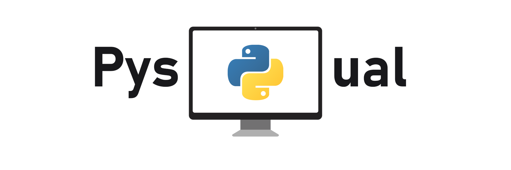

### **Python coding made visual**

 

#  About
Pysual is an open source visual python development software. Everything is fully customizable. You can generate functions, variables, and much more fully custom to your liking. The best part of the whole thing is that its FREE.
  
It allows you to save projects in a file that will remember what you have done. You can also share the file with friends and they can have the same project as you!
  
# Customizable
From games to printing out text; Pysual can do it. You can fully customize your python file by using our customizable blocks to make, making your project much quicker and easier.
  
# Translations
As of right now we only support English. We do plan on implementing several more languages starting at French, Spanish, and Italian.
  
# Framework
This desktop application was made in the Electron framework. Electron is a way to create desktop applications with html. Since it is made in html and uses javascript libraries it does require NodeJS.
  
# Bug Reports
If you have spotted a bug please make sure to report the issue [here](https://github.com/TechPenguineer/Pysual/issues/new).